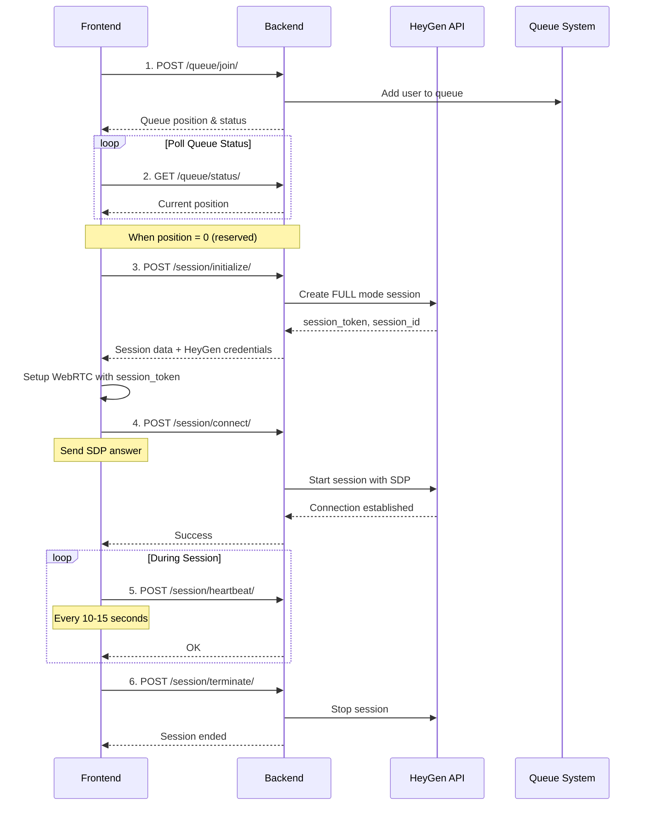

# Frontend-Backend Communication Guide
## Live Avatar Consultation System

Este documento descreve como o frontend deve se comunicar com o backend para gerenciar sessões de consultoria com avatares ao vivo usando HeyGen.

---

## Base URL

```
BASE_URL = /consultoria
```

---

## Fluxo Completo da Sessão



---

## API Endpoints

### 1. Entrar na Fila

**Endpoint:** `POST /api/consultoria/queue/join/`

**Headers:**
```json
{
  "Authorization": "Bearer <access_token>",
  "Content-Type": "application/json"
}
```

**Request Body:**
```json
{
  "agent_type": "gestao"  // ou "comercial", "tecnico"
}
```

**Response (200 OK):**
```json
{
  "id": "uuid",
  "user": 1,
  "agent_type": "uuid",
  "status": "queued",
  "joined_at": "2026-02-11T19:00:00Z",
  "position": 3,
  "estimated_wait_time": 180  // segundos
}
```

**Errors:**
- `400`: Missing agent_type
- `404`: Agent type not found
- `403`: User already in queue or in cooldown

---

### 2. Verificar Status na Fila

**Endpoint:** `GET /api/consultoria/queue/status/`

**Headers:**
```json
{
  "Authorization": "Bearer <access_token>"
}
```

**Response (200 OK):**
```json
{
  "status": "queued",  // ou "reserved"
  "position": 2,
  "estimated_wait_time": 120,
  "agent_type": "gestao"
}
```

**Response quando reservado (200 OK):**
```json
{
  "status": "reserved",
  "position": 0,
  "agent_type": "gestao"
}
```

**Response (404 NOT FOUND):**
```json
{
  "status": "not_queued"
}
```

> **💡 Polling:** Chame este endpoint a cada 3-5 segundos enquanto `status !== "reserved"`

---

### 3. Sair da Fila

**Endpoint:** `POST /api/consultoria/queue/leave/`

**Headers:**
```json
{
  "Authorization": "Bearer <access_token>"
}
```

**Response (200 OK):**
```json
{
  "status": "cancelled"
}
```

---

### 4. Inicializar Sessão

**Endpoint:** `POST /api/consultoria/session/initialize/`

**Headers:**
```json
{
  "Authorization": "Bearer <access_token>",
  "Content-Type": "application/json"
}
```

**Request Body:**
```json
{
  "agent_type": "gestao",
  "avatar_id": "optional-custom-avatar-id",  // Opcional
  "voice_id": "optional-custom-voice-id"     // Opcional
}
```

**Response (200 OK):**
```json
{
  "session": {
    "id": "uuid",
    "user": 1,
    "agent_type": "uuid",
    "status": "active",
    "heygen_session_id": "session_123",
    "started_at": "2026-02-11T19:05:00Z",
    "last_heartbeat": "2026-02-11T19:05:00Z"
  },
  "heygen_data": {
    "session_id": "session_123",
    "session_token": "token_abc123...",
    // Outros dados do HeyGen
  }
}
```

**Errors:**
- `403`: No reservation found (user não tem reserva)
- `500`: Failed to create session

> **⚠️ Importante:** Só pode ser chamado quando `queue/status/` retornar `status: "reserved"`

---

### 5. Conectar Sessão (WebRTC)

**Endpoint:** `POST /api/consultoria/session/connect/`

**Headers:**
```json
{
  "Authorization": "Bearer <access_token>",
  "Content-Type": "application/json"
}
```

**Request Body:**
```json
{
  "session_id": "session_123",
  "sdp": {
    "type": "answer",
    "sdp": "v=0\r\no=- ..."
  }
}
```

**Response (200 OK):**
```json
{
  "status": "connected"
  // Dados retornados do HeyGen
}
```

**Errors:**
- `404`: Session not found
- `500`: Failed to start session

---

### 6. Enviar ICE Candidate

**Endpoint:** `POST /api/consultoria/session/ice/`

**Headers:**
```json
{
  "Authorization": "Bearer <access_token>",
  "Content-Type": "application/json"
}
```

**Request Body:**
```json
{
  "session_id": "session_123",
  "candidate": {
    "candidate": "candidate:...",
    "sdpMid": "0",
    "sdpMLineIndex": 0
  }
}
```

**Response (200 OK):**
```json
{
  "status": "ok"
}
```

---

### 7. Heartbeat (Manter Sessão Ativa)

**Endpoint:** `POST /api/consultoria/session/heartbeat/`

**Headers:**
```json
{
  "Authorization": "Bearer <access_token>",
  "Content-Type": "application/json"
}
```

**Request Body:**
```json
{
  "session_id": "session_123"
}
```

**Response (200 OK):**
```json
{
  "status": "ok"
}
```

**Errors:**
- `403`: Unauthorized (session não pertence ao usuário)
- `404`: Session not found

> **⏱️ Frequência:** Enviar a cada 10-15 segundos durante a sessão ativa
---
### 8. Terminar Sessão

**Endpoint:** `POST /api/consultoria/session/terminate/`

**Headers:**
```json
{
  "Authorization": "Bearer <access_token>",
  "Content-Type": "application/json"
}
```

**Request Body:**
```json
{
  "session_id": "session_123"
}
```

**Response (200 OK):**
```json
{
  "status": "ended"
}
```

**Errors:**
- `404`: Session not found

---

## Exemplo de Implementação (TypeScript/React)

### Hook para Gerenciar Fila

```typescript
import { useState, useEffect } from 'react';

interface QueueStatus {
  status: 'not_queued' | 'queued' | 'reserved';
  position?: number;
  estimated_wait_time?: number;
  agent_type?: string;
}

export function useConsultationQueue(agentType: string) {
  const [queueStatus, setQueueStatus] = useState<QueueStatus | null>(null);
  const [isPolling, setIsPolling] = useState(false);

  // Join queue
  const joinQueue = async () => {
    const response = await fetch('/api/consultoria/queue/join/', {
      method: 'POST',
      headers: {
        'Authorization': `Bearer ${getAccessToken()}`,
        'Content-Type': 'application/json',
      },
      body: JSON.stringify({ agent_type: agentType }),
    });
    
    if (response.ok) {
      const data = await response.json();
      setQueueStatus(data);
      setIsPolling(true);
    }
  };

  // Poll queue status
  useEffect(() => {
    if (!isPolling) return;

    const interval = setInterval(async () => {
      const response = await fetch('/api/consultoria/queue/status/', {
        headers: {
          'Authorization': `Bearer ${getAccessToken()}`,
        },
      });

      if (response.ok) {
        const data = await response.json();
        setQueueStatus(data);

        // Stop polling when reserved
        if (data.status === 'reserved') {
          setIsPolling(false);
        }
      } else if (response.status === 404) {
        setQueueStatus({ status: 'not_queued' });
        setIsPolling(false);
      }
    }, 3000); // Poll every 3 seconds

    return () => clearInterval(interval);
  }, [isPolling]);

  // Leave queue
  const leaveQueue = async () => {
    await fetch('/api/consultoria/queue/leave/', {
      method: 'POST',
      headers: {
        'Authorization': `Bearer ${getAccessToken()}`,
      },
    });
    setQueueStatus({ status: 'not_queued' });
    setIsPolling(false);
  };

  return { queueStatus, joinQueue, leaveQueue };
}
```

### Hook para Gerenciar Sessão

```typescript
import { useState, useEffect, useRef } from 'react';

interface SessionData {
  session_id: string;
  session_token: string;
}

export function useConsultationSession(agentType: string) {
  const [session, setSession] = useState<SessionData | null>(null);
  const heartbeatInterval = useRef<NodeJS.Timeout | null>(null);

  // Initialize session
  const initializeSession = async () => {
    const response = await fetch('/api/consultoria/session/initialize/', {
      method: 'POST',
      headers: {
        'Authorization': `Bearer ${getAccessToken()}`,
        'Content-Type': 'application/json',
      },
      body: JSON.stringify({ agent_type: agentType }),
    });

    if (response.ok) {
      const data = await response.json();
      setSession({
        session_id: data.heygen_data.session_id,
        session_token: data.heygen_data.session_token,
      });
      startHeartbeat(data.heygen_data.session_id);
      return data;
    }
    throw new Error('Failed to initialize session');
  };

  // Start heartbeat
  const startHeartbeat = (sessionId: string) => {
    heartbeatInterval.current = setInterval(async () => {
      await fetch('/api/consultoria/session/heartbeat/', {
        method: 'POST',
        headers: {
          'Authorization': `Bearer ${getAccessToken()}`,
          'Content-Type': 'application/json',
        },
        body: JSON.stringify({ session_id: sessionId }),
      });
    }, 10000); // Every 10 seconds
  };

  // Terminate session
  const terminateSession = async () => {
    if (!session) return;

    if (heartbeatInterval.current) {
      clearInterval(heartbeatInterval.current);
    }

    await fetch('/api/consultoria/session/terminate/', {
      method: 'POST',
      headers: {
        'Authorization': `Bearer ${getAccessToken()}`,
        'Content-Type': 'application/json',
      },
      body: JSON.stringify({ session_id: session.session_id }),
    });

    setSession(null);
  };

  // Cleanup on unmount
  useEffect(() => {
    return () => {
      if (heartbeatInterval.current) {
        clearInterval(heartbeatInterval.current);
      }
    };
  }, []);

  return { session, initializeSession, terminateSession };
}
---
## Regras e Limitações
### Timeouts e Limites
- **Duração máxima da sessão:** 20 minutos
- **Período de reconexão:** 2 minutos após desconexão
- **Cooldown após sessão:** 5 minutos antes de poder entrar na fila novamente
- **Timeout de reserva:** Se não inicializar a sessão em X minutos, volta para a fila
### Estados da Sessão
| Estado | Descrição |
|--------|-----------|
| `active` | Sessão ativa e conectada |
| `disconnected` | Conexão perdida, pode reconectar em até 2 minutos |
| `ended` | Sessão encerrada |
| `cooldown` | Usuário em período de cooldown |
### Tratamento de Erros
```typescript
// Exemplo de tratamento de erro
try {
  await initializeSession();
} catch (error) {
  if (error.status === 403) {
    // No reservation found - voltar para a fila
    console.error('Você precisa estar na fila primeiro');
  } else if (error.status === 500) {
    // Server error - tentar novamente
    console.error('Erro ao criar sessão. Tente novamente.');
  }
}
```
---

## Notas Importantes
2. **Polling:** Use polling inteligente - aumente o intervalo se o servidor estiver lento
3. **Heartbeat:** Crítico para manter a sessão ativa - não esqueça de implementar
4. **Cleanup:** Sempre limpe intervalos e termine sessões ao desmontar componentes
5. **WebRTC:** A configuração WebRTC deve usar o `session_token` retornado pelo endpoint `/session/initialize/`