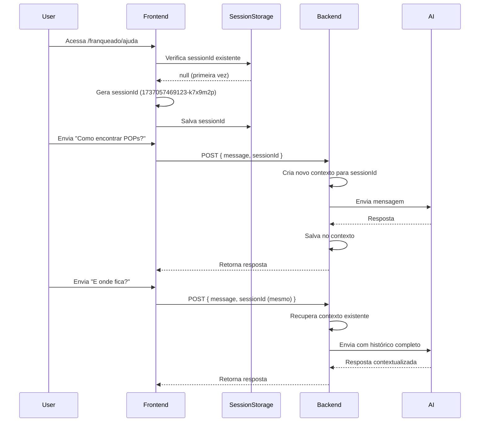

# 📋 Documentação: Session ID para Memória Temporária da IA

## 🎯 Objetivo
Implementar memória contextual temporária para conversas com IA, permitindo que o backend mantenha o contexto da conversa durante a sessão do usuário.

---

## 🔑 Como Funciona

### **Frontend (Next.js)**

1. **Geração do Session ID**
   - Ao carregar a página `/franqueado/ajuda`, um `sessionId` único é gerado
   - Formato: `timestamp-random` (ex: `1737057469123-k7x9m2p`)
   - Armazenado no `sessionStorage` do navegador

2. **Persistência**
   - ✅ **Mantém durante navegação**: Se o usuário navega para outra página e volta, o mesmo `sessionId` é reutilizado
   - ❌ **Reseta ao recarregar**: Ao dar F5 ou recarregar a página, um novo `sessionId` é gerado
   - 🔄 **Reset manual**: Botão "Nova Conversa" gera um novo `sessionId`

3. **Envio para Backend**
   - Cada mensagem enviada inclui o `sessionId` no body da requisição:
   ```json
   {
     "message": "Como encontrar o curso de POPs?",
     "sessionId": "1737057469123-k7x9m2p"
   }
   ```

---

## 🛠️ Implementação no Backend (n8n)

### **Endpoint**: `POST https://n8n-n8n.i4khe5.easypanel.host/webhook/ajuda`

### **Payload Recebido**
```json
{
  "message": "string",
  "sessionId": "string"
}
```

### **Como Usar o Session ID**

#### **Opção 1: Armazenar Contexto em Memória (Recomendado para n8n)**
```javascript
// Exemplo em n8n (Function Node)

// Estrutura de armazenamento global (simular memória)
const sessionMemory = $node["Global"].json.sessionMemory || {};

const sessionId = $input.item.json.sessionId;
const userMessage = $input.item.json.message;

// Recupera histórico da sessão
if (!sessionMemory[sessionId]) {
  sessionMemory[sessionId] = {
    messages: [],
    createdAt: new Date().toISOString()
  };
}

// Adiciona mensagem ao histórico
sessionMemory[sessionId].messages.push({
  role: 'user',
  content: userMessage,
  timestamp: new Date().toISOString()
});

// Envia contexto completo para a IA
const contextMessages = sessionMemory[sessionId].messages;

// Após receber resposta da IA, adiciona ao histórico
sessionMemory[sessionId].messages.push({
  role: 'assistant',
  content: aiResponse,
  timestamp: new Date().toISOString()
});

// Salva de volta no Global
$node["Global"].json.sessionMemory = sessionMemory;

return { sessionId, contextMessages };
```

#### **Opção 2: Armazenar em Redis/Database**
```javascript
// Pseudo-código para armazenamento persistente

const sessionId = request.body.sessionId;
const userMessage = request.body.message;

// Busca histórico do Redis
const history = await redis.get(`chat:${sessionId}`);
const messages = history ? JSON.parse(history) : [];

// Adiciona nova mensagem
messages.push({ role: 'user', content: userMessage });

// Envia para IA com contexto
const aiResponse = await callAI(messages);

// Salva resposta
messages.push({ role: 'assistant', content: aiResponse });

// Armazena com TTL de 1 hora
await redis.setex(`chat:${sessionId}`, 3600, JSON.stringify(messages));

return aiResponse;
```

#### **Opção 3: Enviar Histórico Completo (Simples)**
Se preferir, pode simplesmente usar o `sessionId` como identificador e manter o histórico no frontend, enviando todas as mensagens anteriores em cada requisição.

---

## 🧪 Testando

### **Cenário 1: Nova Sessão**
1. Abra `/franqueado/ajuda`
2. Envie: "Quem é responsável por Marketing?"
3. **Esperado**: Backend recebe `sessionId` novo (ex: `1737057469123-k7x9m2p`)

### **Cenário 2: Continuação da Conversa**
1. Na mesma aba, envie: "E por Suporte?"
2. **Esperado**: Backend recebe o **mesmo** `sessionId`
3. **Backend deve**: Usar contexto anterior para entender que "E por Suporte?" se refere à pergunta anterior

### **Cenário 3: Reload da Página**
1. Recarregue a página (F5)
2. Envie: "Quem é responsável por Marketing?"
3. **Esperado**: Backend recebe um **novo** `sessionId` (ex: `1737057469456-x3m8k1z`)

### **Cenário 4: Nova Conversa Manual**
1. Clique no botão "Nova Conversa"
2. Envie uma mensagem
3. **Esperado**: Backend recebe um **novo** `sessionId`

---

## 📊 Exemplo de Fluxo Completo



---

## 🔒 Considerações de Segurança

1. **Não armazene dados sensíveis**: O `sessionId` é temporário e não deve ser usado para autenticação
2. **TTL (Time To Live)**: Configure expiração automática no backend (ex: 1 hora de inatividade)
3. **Limpeza**: Implemente rotina para limpar sessões antigas
4. **Rate Limiting**: Use o `sessionId` para controlar taxa de requisições por sessão

---

## 📝 Resumo para o Backend

**O que você precisa fazer:**

1. ✅ Receber o campo `sessionId` no payload
2. ✅ Usar o `sessionId` como chave para armazenar/recuperar histórico de mensagens
3. ✅ Enviar o histórico completo para a IA para manter contexto
4. ✅ Implementar limpeza automática de sessões antigas (TTL)

**Exemplo de resposta esperada:**
```json
{
  "output": "O responsável por Marketing é João Silva. Você pode encontrá-lo na seção de Suporte > Equipe."
}
```

---

## 🚀 Próximos Passos

- [ ] Backend implementar armazenamento de contexto por `sessionId`
- [ ] Configurar TTL de 1 hora para sessões
- [ ] Testar continuidade de conversa
- [ ] (Opcional) Adicionar indicador visual do `sessionId` no frontend para debug
